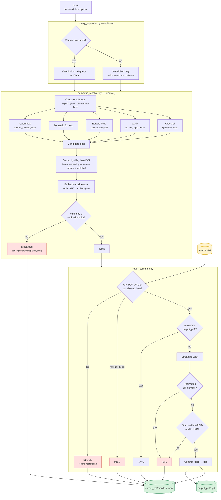

# Semantic Paper Finder

Finds open-access papers from a **description of what you want**, not a citation. Ranks them by embedding similarity and downloads the top matches — only from sites you have explicitly allowed.

The counterpart to [`source-tool/`](../source-tool/README.md). That tool resolves a paper you can already name; this one handles the case where you only know the topic — *"transformer architectures applied to protein structure prediction"* is not a title and will never match one.

**Working as of 2026-08-07.** Verified end-to-end against the live APIs on Python 3.14 / Windows, with Ollama 0.32.6 + `qwen3:1.7b` for expansion:

```powershell
py fetch_semantic.py "attention mechanisms for neural machine translation" -k 5
#  OK   [1] Interrogating the Explanatory Power of Attention in NMT   sim=0.748
#  OK   [3] An Analysis of Attention Mechanisms: Word Sense Disambig.  sim=0.720
#  OK   [4] Effective Approaches to Attention-based NMT               sim=0.716
#  downloaded=3  unresolved=2
```

Before trusting the output, read [Known limitations](#known-limitations-and-open-problems) — in particular **#1, which explains what the similarity floor can and cannot do.** It is not the identity guard `source-tool` has.

**Validated 2026-08-08** — 127 offline assertions and 9 live end-to-end cases (137 offline today; run-cost accounting was added after that validation). [`VALIDATION.md`](VALIDATION.md) records which claims on this page were checked, which were re-measured differently, and which parts have no coverage at all. Start there if you need to know how far to trust a given behaviour.

---

## What this tool does not guarantee

`source-tool`'s safety property is **identity**: a hit must prove it is *the paper you asked for*, via a matching DOI or a title similarity above 0.82. That guard works by comparing against a requested title — and in semantic search there is no requested title, so it is **structurally unavailable here**.

What replaces it is a similarity floor plus provenance:

- A result is **the nearest match among what retrieval happened to return.** It is not verified to be any particular paper.
- An empty result means **nothing cleared the floor**, not that no such research exists.
- Every manifest record carries the similarity, the full abstract, and which sources and query variants surfaced it — so a human or a downstream verifier can judge relevance rather than trusting the rank.

Read the abstract before citing anything this tool returns.

---

## Install

```powershell
py -m pip install -r requirements.txt
```

Pulls `sentence-transformers` and `torch` (~2 GB). Verified on Python 3.14 / win_amd64 — `torch` 2.13.0 ships a `cp314` wheel. The first ranking run downloads the embedding model (`allenai-specter`, ~250 MB) into the HuggingFace cache; every run after that sets `HF_HUB_OFFLINE` for itself, so it neither calls the Hub nor prints the `HF_TOKEN` notice. Delete the cache and the next run downloads it again.

Optional — the local query-expansion model:

```powershell
winget install --id Ollama.Ollama --exact   # or https://ollama.com/download
ollama pull qwen3:1.7b                      # ~1.4 GB
```

Ollama is not a Python dependency — it is a separate install reached over HTTP, and it starts a background server automatically. Skip it and the tool searches with the description alone, printing a one-line notice.

Expansion is on by default, but **it does not always help** — see [limitation #4](#4-query-expansion-helps-or-hurts-depending-on-the-description--measured-use---no-expand) for the measurements and when to reach for `--no-expand`.

Set your contact email in `semantic_resolver.py` before the first run:

```python
CONTACT_EMAIL = "you@example.com"
```

Crossref and OpenAlex demote unidentified clients into a throttled anonymous pool.

Optional — a [Semantic Scholar API key](https://www.semanticscholar.org/product/api). Without one that source returns `429` to *every* request and is skipped; the other four still work. See [limitation #3](#3-semantic-scholar-is-effectively-unavailable-without-a-key--mitigated-not-solved).

```powershell
$env:S2_API_KEY = "your-key"
```

> On macOS/Linux use `python3` in place of `py` in every command below.

---

## Commands

| Command | What it does |
|---|---|
| `py fetch_semantic.py "how X affects Y"` | Search, rank, download the top 5 |
| `py fetch_semantic.py "..." -k 10` | More results |
| `py fetch_semantic.py "..." --dry-run` | Rank and print scores, download nothing |
| `py fetch_semantic.py "..." --min-similarity 0.0 --dry-run --rank-only` | See the raw score distribution — how you calibrate |
| `py fetch_semantic.py "..." --no-expand` | Skip query expansion |
| `py fetch_semantic.py "..." --rank-only` | Fill the top-k strictly by score, even with papers that have no fetchable PDF |
| `py fetch_semantic.py "..." --model sentence-transformers/all-MiniLM-L6-v2` | A different embedding model — pass `--min-similarity` too, the floor is model-specific |
| `py fetch_semantic.py "..." --per-source 30` | Widen the candidate pool |
| `py fetch_semantic.py --from-file topics.txt` | Batch, one description per line |
| `py fetch_semantic.py "..." --sources my_sources.txt --out pdfs` | Different allowlist / output dir |
| `py fetch_semantic.py "..." --any-host` | Ignore the allowlist entirely |
| `py fetch_semantic.py "..." --dump-pool pool.jsonl` | Also write the deduped candidate pool, unscored, for `bench_ranking.py` |
| `py bench_ranking.py pool.jsonl --models a,b` | Re-rank that frozen pool with each model — how you compare models and recalibrate |
| `py query_expander.py "..."` | Test the expander alone |
| `py semantic_resolver.py` | Resolve-only smoke test, no downloads |
| `py test_selection.py` | Offline tests for selection and backoff — no network |
| `py test_validation.py` | Offline tests for parsing, dedup, download and the allowlist — no network |

### Batch file format (`--from-file`)

One description per line. Blank lines and `#` comments ignored.

```
transformer architectures for protein structure prediction
methods for detecting hallucination in large language models
# this line is ignored
retrieval augmented generation for scientific question answering
```

---

## Files

| File | Role |
|---|---|
| **`sources.txt`** | **The file you edit.** Sites you allow PDFs to come from, one per line. Inline `#` comments are stripped. |
| `semantic_resolver.py` | The library. Retrieval fan-out, dedup, ranking, top-k selection. Exposes the agent tool schema. |
| `test_selection.py` | Offline tests for selection and backoff. No network. |
| `test_validation.py` | Offline tests for retrieval parsing, dedup, the download guard chain, the allowlist, the manifest contract and the expander. No network. |
| **`VALIDATION.md`** | **What has been validated, how, and what has not** — claim-by-claim, with the commands that reproduce each result. |
| `validation_pool.jsonl` | The frozen 332-paper candidate pool `VALIDATION.md`'s score table was measured on. Committed because retrieval is nondeterministic, so the table can be re-derived with `bench_ranking.py`. |
| `bench_ranking.py` | Offline model comparison. Re-ranks a `--dump-pool` snapshot with several models. No network after the models are cached. |
| `embedder.py` | `sentence-transformers` wrapper. Lazy — the torch import is paid only when ranking runs. Owns the title/abstract join, which is model-specific. |
| `query_expander.py` | Ollama client. Description → query variants, with a fallback that cannot fail. |
| `fetch_semantic.py` | CLI runner. Allowlist, download, manifest. |
| `runcost.py` | What a run cost — wall time, CPU time, peak RAM. Dependency-free; a verbatim copy lives in `source-tool/`. |
| `requirements.txt` | `httpx`, `sentence-transformers`. |
| `output_pdf/` | Created on first run. Downloaded PDFs. |
| `output_pdf/manifest.jsonl` | Appended every run — one JSON record per result, each carrying what the run cost. |

**This tool is self-contained.** The allowlist and download helpers in `fetch_semantic.py` are deliberate copies of `source-tool`'s rather than imports, so this folder can be moved on its own. The tradeoff: a fix to either tool's download path has to be applied twice.

---

## Data flow



### Why expansion matters more than the reranker

Embedding rank cannot recover a paper that retrieval never returned — **retrieval breadth is the quality ceiling of the whole tool.** One description phrased one way hits one slice of each index. Expansion turns it into several differently-worded queries so the fan-out covers more ground.

The five sources overlap far less than you would expect. On the verified query above, 42 candidates deduplicated to 36 distinct papers — only one was found by more than one source. The fan-out is genuinely widening coverage, not returning the same ten papers five times.

### How the top-k is chosen

Similarity picks the *ordering*; fetchability picks the *membership*. Ranking by
score alone is wrong for a tool whose output is a directory of PDFs — the highest
-scoring paper is worthless here if nobody serves it.

Measured on `"best time for playing instruments"` (2026-08-07): 22 candidates
cleared the floor and 12 had a PDF, but only 2 of the top 5 did. Crossref, which
contributes DOIs rather than open access, held ranks 1/3/4 and crowded out
fetchable arXiv and Europe PMC papers sitting at ranks 10-22. **The run
downloaded nothing.** Selecting fetchable-first turns that into 5 of 5.

1. Rank every candidate by similarity, exactly as before.
2. Probe candidates' PDF URLs in widening batches (`3 × k` at a time), stopping
   as soon as `k` fetchable papers are found — an easy query pays one batch.
3. Fill the k slots from the fetchable ones, then backfill with the rest so a
   paywalled-but-relevant paper still surfaces as a `MISS`.
4. Sort the chosen k back into descending similarity, so printed scores always
   decrease down the list.

The probe is a `HEAD` with an 8 s timeout, and it respects your allowlist — a
paper only available on a host `sources.txt` excludes is not "fetchable", so it
never wins a slot it would just lose to `BLOCK`.

Probes are capped at 3 concurrent per host. One query's candidates cluster hard
on a few hosts — 12 of 23 probes in a measured batch went to `arxiv.org` — and an
unbounded window would open that many connections to one server at once, which is
how a tool earns an IP block. Measured at the HTTP layer, peak in-flight per host
is exactly 3.

Because membership is no longer the top k by score, every record carries
`similarity_rank` alongside `rank`, and the console prints `(#N by score)` when
they differ. Nothing is hidden; the reordering is on the page.

```
OK    [1] Music Performance Improvement Support System...
      sim=0.404  europepmc  (#6 by score)
```

Pass `--rank-only` for the old behavior — the k most similar papers regardless of
whether they can be fetched.

### Where each guard sits

| Guard | Stage | Catches |
|---|---|---|
| Dedup by title, then DOI | Resolver | The same work occupying several of the k slots — including a preprint and its published version, which carry different DOIs |
| `--min-similarity` floor | Resolver | The irrelevant tail. **Not an identity guard** — see limitation #1 |
| Title-only penalty | Resolver | A bare title outranking a real abstract match on a short query |
| `doi.org` filter | Resolver | Semantic Scholar returning a DOI redirector in `openAccessPdf`, which is a landing page, not a PDF |
| `documentStyle == "pdf"` | Resolver | Europe PMC landing pages masquerading as full text |
| `HEAD` / `%PDF-` sniff | Resolver | A `.pdf` URL that actually serves an HTML paywall |
| Allowlist filter | Runner | Mirrors, aggregators, and pirate sites |
| Post-redirect re-check | Runner | A trusted link that bounces somewhere untrusted |
| Magic bytes + size | Runner | Login pages and truncated transfers reaching disk |

### Network resilience

`_get()` retries up to `max_retries` (default 3) with exponential backoff on **both** `429`/`5xx` status codes *and* transport-level failures. Scholarly APIs frequently throttle by stalling the connection rather than answering `429`; without this, one hiccup silently deletes a whole source from the fan-out.

A source that still fails lands in `errors` and the run continues on the other four. **A run with errors is not a failed run** — every verified run above succeeded while Semantic Scholar was returning `429`.

**`Retry-After` is capped at 30 s.** Obeying it literally lets an API stop the run: OpenAlex answers an exhausted quota with `Retry-After: 36494` — about ten hours — and a bare `sleep()` on that hangs the tool with no output and no error, looking exactly like a slow network. Past the cap the source is dropped into `errors` for this run instead, and the other four finish. Verified 2026-08-07 with OpenAlex genuinely out of quota: the run completed in **15 s** rather than hanging.

**One exception to the backoff:** an unauthenticated `429` from `api.semanticscholar.org` fails immediately instead of retrying. S2's anonymous pool is shared globally and returns `429` to an idle `curl` (verified 2026-08-07, three probes, zero load) — backing off 1 s/2 s/4 s cannot outwait a quota that was already exhausted before we arrived, it only adds ~7 s of dead time per query. Set `S2_API_KEY` and the normal backoff applies again, because then a `429` means *you* exceeded *your own* quota, which is exactly what backoff is for.

**Alternate-host fallback.** A download failure falls through to the next allowed host for the same paper rather than giving up. One work is routinely listed on several — a publisher that 403s, a repository mirror, a PMC copy — and the first is not the likeliest to serve. Measured 2026-08-07: a Europe PMC hit failed on its chosen NCBI URL while a working `europepmc.org` copy sat unused in `alternatives`; with the fallback it downloads. Each attempt re-runs the full guard chain inside `download()` — post-redirect allowlist re-check, `%PDF-` sniff, size floor — so this relaxes *persistence*, never *safety*. `FAIL` now means every allowed host failed, and the detail line names each one.

---

## Statuses

| Status | Meaning | What to do |
|---|---|---|
| `OK` | Downloaded and validated | — |
| `HAVE` | Already in the output directory | — |
| `MISS` | Either nothing cleared the similarity floor, or this paper has no open-access PDF | Lower `--min-similarity`, widen `--per-source`, or rephrase |
| `BLOCK` | Found, but not on an allowed host | Add the host to `sources.txt`, or leave blocked |
| `FAIL` | Resolved, but **every** allowed host failed download or validation | Usually a paywall or a 403; the detail line names each host that failed |

Read `manifest.jsonl` rather than listing the directory — it carries the similarity, abstract, and provenance that judging relevance requires.

### Manifest schema

A **superset of `source-tool`'s**, so one consumer can read both. Every record carries `source-tool`'s five keys with the same meanings — `query`, `status`, `path`, `detail`, and a `resolution` block holding `pdf_url`, `doi`, `matched_title`, `confidence`, `source`, `alternatives`, `errors` — plus two blocks of its own:

- `paper` — `rank`, `similarity_rank`, `similarity`, `confidence`, `title`, `doi`, `abstract`, `title_only`, `pdf_url`, `pdf_urls`, `landing_url`, `pdf_verified`, `retrieval_sources`, `matched_queries`
- `run` — `query_description`, `expanded_queries`, `expansion_error`, `embedding_model`, `min_similarity`, `selection`, `verified_window`, `pool_size`, `truncated_sources`, `errors`

and one key `source-tool` now writes too, in the same place, so a single consumer reads it from either manifest:

- `usage` — `wall_seconds`, `cpu_seconds`, `cpu_percent`, `peak_rss_bytes`, `rss_bytes`

`rank` is the position in the output; `similarity_rank` is where the paper would have sat under pure score. They differ whenever fetchable-first selection skipped over something unfetchable, and `run.selection` (`pdf_preferring` or `rank_only`) says which rule produced the set. `verified_window` is how far down the ranking PDFs were probed.

`query` is always the input description, never a result title — matching `source-tool`, where the field is always the input. The rank-and-title string the console prints lives in `label`.

`similarity` is the raw cosine. `confidence` is that score discounted to 0.7× when the PDF URL was not confirmed fetchable — the same shape and meaning as `source-tool`'s `confidence`, so the two are comparable as *numbers*. They are not comparable as *evidence*: `source-tool`'s is grounded in a DOI or title match, this one in a cosine against a description. See limitation #1.

---

## Run cost

Every run ends with what it cost, and every manifest record written by that run carries the same figures under `usage`. `--dry-run` reports it too — it loads the same model, so it costs nearly the same.

```
run cost: 53s wall  149s CPU (283% of one core)  peak RAM 1.33 GB  (now 797 MB)
```

That is one description, `--no-expand`, a 77-paper pool, on the default `allenai-specter`. Reading it:

| Field | Meaning |
|---|---|
| `wall_seconds` | Measured from the program's first line, so the model load is inside it |
| `cpu_seconds` | This process, across all its threads — including the native ones torch spawns inside `encode()`, which is why it can exceed the wall clock |
| `cpu_percent` | `cpu_seconds` over `wall_seconds`, as a share of **one** core. 283% is torch encoding on every core it can find; the retrieval and download phases sit near 0% because they are waiting on APIs |
| `peak_rss_bytes` | The OS's own process-lifetime high-water mark. Almost all of it is the embedding model — `now` is lower because the encoded batch is freed before the run ends |
| `rss_bytes` | Resident at the moment the line was printed |

**This is the number to watch when changing models.** `bench_ranking.py` prints the same line and writes it into its `--json` report, so a model that ranks marginally better for twice the RAM shows up as the trade-off it is.

Two things it does not count. **Ollama is a separate process** — query expansion's CPU and RAM are spent over there and are invisible here, so a run with `--no-expand` and one without are not comparable on these figures alone. And the **first ever run downloads the model** (~250 MB), which lands in wall time but not in RAM. The figures are also whole-run rather than per-description: descriptions are processed concurrently and ranking one blocks another's I/O, so there is nothing meaningful to divide.

---

## Calibrating the floor

`--min-similarity` is **model-specific and must be measured, not guessed.** Run a query at `--min-similarity 0.0 --dry-run` and read the printed distribution:

```
scores: max=0.748  top10%=0.711  median=0.585  min=-0.036
```

That line is computed before selection, so the numbers are the whole scored pool
either way. The papers *listed under it* are not: `--dry-run` still selects
fetchable-first. **Add `--rank-only` when you want the listing to be the
highest-scoring papers**, which is usually what you want while calibrating.

Measured on 2026-08-08 with the default model (`allenai-specter`), over a frozen 363-paper pool:

| Query | max | median | min | survive `0.70` | of those, `title_only` |
|---|---|---|---|---|---|
| `attention mechanism for neural machine translation` | 0.880 | 0.776 | 0.545 | 71 / 89 | 15 |
| `graph neural networks for molecular property prediction` | 0.895 | 0.747 | 0.616 | 51 / 62 | 12 |
| `retrieval augmented generation for open-domain question answering` | 0.907 | 0.808 | 0.667 | 88 / 89 | 13 |
| a loosely-worded paraphrase of the first query | 0.848 | 0.665 | 0.452 | 23 / 73 | 2 |
| a deliberately nonsensical query | 0.777 | 0.621 | 0.454 | **6 / 50** | 1 |

The **top-5** correct answers landed between 0.84 and 0.91 and the nonsense query topped out at 0.777; ranks below 5 were not inspected, so the *weakest* correct answer is not established — treat 0.84 as the bottom of what was looked at, not as a measured lower bound.

**`MIN_SIMILARITY` and `TITLE_ONLY_PENALTY` multiply — calibrate the product, not the distribution.** A paper with no abstract is scored `raw × 0.85`, so it only survives at `raw ≥ MIN_SIMILARITY / 0.85`. The distribution alone argues for a floor of `0.75`, which puts that bar at **0.882** — above the entire pool ceiling on both low-scoring queries above (0.848 and 0.829). That is not a demotion, it is a categorical exclusion of every abstract-less paper, and it bites hardest on vague queries where recall matters most. `0.70` puts the bar at 0.824 and keeps them reachable on all five queries, at the cost of letting the nonsense query return 6 results instead of 1.

**Changing `--model` invalidates this number** — and not loudly. The previous default (`all-MiniLM-L6-v2`) was calibrated at `0.35`; carried onto specter unchanged, that floor lets **100% of every pool through, on all five queries**. A stale floor does not error, it just stops filtering. Re-run the calibration.

The floor is also stricter in absolute terms than the old one, and this was measured on five queries — three of them the tool's own demo topics. A legitimate query whose pool ceiling sits near 0.80 now yields few survivors, and if none of them are fetchable the run reports `MISS` where the looser regime would have returned something. If that happens, lower `--min-similarity` before concluding the papers do not exist.

### Comparing models

Do **not** calibrate by running `fetch_semantic.py` once per model. Retrieval is the noisy part of this pipeline — OpenAlex and Semantic Scholar `429`d on every query during this measurement — so two runs minutes apart see different pools, and the comparison measures source availability rather than the model. Freeze the pool once, then re-rank it:

```
py fetch_semantic.py --from-file topics.txt --dry-run --rank-only \
    --min-similarity 0.0 --no-expand --dump-pool pool.jsonl
py bench_ranking.py pool.jsonl --models sentence-transformers/all-MiniLM-L6-v2,sentence-transformers/allenai-specter
```

`bench_ranking.py` prints, per model and query: the score distribution, how many papers **overran the model's input window** (the number that decided this swap), how many were scored on title alone, and the top-k titles. Score distributions are not comparable across models — the titles are the quality signal, and a nonsense control query is what bounds the floor from below.

It ends with the same `run cost:` line the runner prints, and `--json` carries it as a `usage` block beside `models`. That figure covers every model in `--models` together, since peak RAM is a process high-water mark — to price one model, run it alone.

---

## Using it as an agent tool

`semantic_resolver.py` exports both halves of the tool surface:

```python
from semantic_resolver import FIND_PAPERS_BY_DESCRIPTION_TOOL, find_papers_by_description

# FIND_PAPERS_BY_DESCRIPTION_TOOL -> pass in your tool list (Anthropic schema)
# find_papers_by_description(description=..., top_k=5) -> await on the tool_use event
```

The tool description states explicitly that results are **not** verified to be any specific paper, and that an empty list means nothing cleared the floor rather than that no such research exists. Both sentences are load-bearing — without them an agent will report fabrication where there is only a weak match or a paywall.

For batches, hold one resolver open so connections and the loaded embedding model are reused:

```python
async with SemanticResolver() as resolver:
    for topic in topics:
        result = await resolver.resolve(topic, top_k=5)
```

---

## Known limitations and open problems

Ordered by how much damage they can do downstream.

### 1. The similarity floor is a tail filter, not an identity guard — *inherent, measured*

This is the most important thing to understand about the tool. `source-tool` can prove a hit is the paper you asked for. **This tool cannot, and no threshold makes it able to.**

Measured on 2026-08-07 with the then-default `all-MiniLM-L6-v2`:

- A **correct** answer to a loosely-worded query (Bahdanau et al., the actual attention paper) scored **0.468**.
- The top hit of a **deliberately nonsensical** query scored **0.529**.

The correct answer scored *lower* than the nonsense hit. Cosine similarity is not comparable across queries, so no absolute floor separates the two cases.

Re-measured on 2026-08-08 with `allenai-specter`, the ordering is no longer inverted but the margin is thin: a loose query's correct answer scored **0.848** against the nonsense query's best hit at **0.777**. Better, and still not a guard — 0.07 is not a safety margin, and it was measured on five queries.

An inter-result coherence metric was also tested as a discriminator and **rejected**: one nonsense query produced a coherence of 0.670, higher than a legitimate paraphrased query's 0.536.

What the floor does do is remove the clearly-irrelevant tail — at `0.70` the nonsense query returns 6 results instead of 50 — which is worth having. What protects you beyond that is the manifest: read the abstract and the `retrieval_sources` before relying on a result. **Do not feed this tool's output to a downstream verifier as though identity had been checked.**

### 2. Retrieval breadth caps everything — *mitigated, not solved*

No amount of reranking recovers a paper the five APIs never returned. Query expansion widens the net, but with `--per-source 20` all four working sources routinely hit the cap on a broad query (reported as `truncated_sources` in the manifest — the tool never caps silently). Raise `--per-source` for recall at the cost of latency and embedding time.

### 3. Semantic Scholar is effectively unavailable without a key — *mitigated, not solved*

S2 `429`s unauthenticated clients most of the time regardless of load — three bare `curl` probes three seconds apart returned `429, 429, 429` on 2026-08-07, with no traffic from us. Its anonymous search pool is shared across all callers, so this is not something rate-limiting on our side can fix. It is not *total*: one verified run the same day did get through and contributed a hit (`semantic_scholar+europepmc`). Treat the source as present but unreliable, never as absent.

The tool now fails fast on that case instead of burning ~7 s per query on retries that cannot succeed, and the error still lands in `errors` so the run is self-describing. **The run continues on the other four sources** — but expect roughly 20% less retrieval breadth, and a paper only S2 knows about stays invisible.

To restore the source, get a free key from the [S2 API portal](https://www.semanticscholar.org/product/api) and export it:

```powershell
$env:S2_API_KEY = "your-key"      # PowerShell
export S2_API_KEY="your-key"      # bash
```

It is sent as `x-api-key` on S2 requests only, and it is entirely optional — every other source works without it.

### 4. Query expansion helps or hurts depending on the description — *measured, use `--no-expand`*

Verified against a live Ollama (0.32.6, `qwen3:1.7b`) on 2026-08-07. It runs in ~14 s and returns clean queries. Whether it *helps* is not uniform:

| Description | Pool without → with | Effect |
|---|---|---|
| `deep learning methods for predicting protein structure` | 95 → 182 | **Helped.** Best score 0.826 → 0.835; the top-3 became sharper on-topic matches. |
| a layperson paraphrase of "attention mechanisms in NMT" | 78 → 293 | **Hurt.** The correct answer (Bahdanau et al.) fell out of the top-6, displaced by generic short-titled papers like *"Sequence Learning"* at 0.489. |

The pattern: when the description already uses the field's terminology, the variants stay on target and widen coverage usefully. When it is a vague paraphrase, a 1.7B model's variants drift — in the failing case it produced four near-duplicates of one idea rather than the four distinct angles the prompt asks for — and the extra candidates are noise the ranker cannot filter (see limitation #1, the same root cause).

**If a search returns generic results, re-run with `--no-expand`.** A larger model (`--ollama-model qwen3:8b`) would likely produce more diverse variants; untested.

Expansion and retrievability interact: on `"best time for playing instruments"` the extra variants pulled in higher-scoring Crossref records that had no PDF behind them, which is what pushed the fetchable papers out of the top 5. Fetchable-first selection absorbs that, so expansion's drift now costs ranking quality rather than costing you the whole download.

Two smaller effects worth knowing, both visible in that failure:

- Very short generic titles (*"Sequence Learning"*, two words) score inflated against short queries. The `TITLE_ONLY_PENALTY` of 0.85 is flat and does not account for how little text there is.
- The model occasionally hallucinates a variant into an unrelated field (one run produced *"focus sequence attention in genetic models"*). Harmless in isolation — it just retrieves candidates the ranker then scores low — but it costs API calls.

### 5. Crossref contributes almost no abstracts or PDFs — *mitigated*

Crossref returned abstracts for 2 of 10 hits on the verified query, and its `link` PDFs are usually publisher-gated. It earns its place on DOI and identity coverage, not on ranking signal. Its abstract-less hits are ranked on title alone with a 0.85 penalty and flagged `title_only` in the manifest.

It used to be able to swallow the whole result set — on `"best time for playing instruments"` it held ranks 1/3/4 with no PDF behind any of them. Fetchable-first selection removed that failure mode without dropping the source, so its DOI coverage is retained. `--rank-only` restores the old behaviour, including this problem.

### 6. Every run re-queries every API — *minor*

No caching between runs. `HAVE` short-circuits the *download* once a file is on disk, but resolution still costs (sources × queries) API calls every time. Fine for tens of descriptions, wasteful for thousands.

### 7. Test coverage is partial — *narrowed*

`py test_selection.py` covers top-k selection, `Retry-After` backoff and probe pacing with 27 asserting offline tests. `py test_validation.py` adds 110 more over retrieval parsing, dedup, the download guard chain, the allowlist, the manifest contract, run-cost accounting and the expander — 100 of them at the 2026-08-08 validation, the rest added with `runcost.py`. Neither touches the network, so both are deterministic and safe to run against throttled APIs. That is where a bug is *silent*: bad selection still returns plausible papers, just not the ones you could have had.

**Ranking is still not asserted on** — there is no ground-truth set, so nothing checks that the top result is the *right* paper. It is inspectable offline instead: `--dump-pool` freezes a real candidate pool and `bench_ranking.py` re-scores it, so a change to the model or to the embedded text can be compared against a known pool rather than a fresh, differently-throttled run. `py semantic_resolver.py` is a smoke test that asserts nothing — you have to read its JSON.

Several paths remain untested — notably the **`FAIL` / alternate-host fallback loop** (no download failed during validation, so it never executed), cross-model calibration, and every non-default flag combination. See [`VALIDATION.md`](VALIDATION.md) for the full coverage map, including what is *not* covered.

### 8. OpenAlex has a daily quota you can exhaust — *handled, not avoidable*

OpenAlex meters by credits (`X-RateLimit-Remaining: 0`) and, once you are out, `429`s every request until the quota resets — around ten hours, per its own `Retry-After`. Heavy testing reaches this easily; it was hit on 2026-08-07 during this tool's own development. The run now drops the source and continues on the other four (see [Network resilience](#network-resilience)), but recall is meaningfully lower while it lasts — OpenAlex is the broadest of the five. There is no key to raise it; the `mailto` polite pool does not exempt you.

### Also worth knowing

- The repo's `.gitignore` covers `__pycache__/` and `tools/*/output_pdf/`. It does **not** untrack files already committed — five artifacts under `tools/source-tool/` (four in `output_pdf/`, one `.pyc`) predate it and need `git rm --cached` to remove. The embedding-model cache lives in `~/.cache/huggingface`, outside the repo.
- Paywalled publishers in the starter `sources.txt` (ScienceDirect, Wiley, IEEE, ACM, PNAS) pass the host check and then fail PDF validation on the login page. With the alternate-host fallback they no longer end the attempt — a free mirror listed for the same paper is tried next — but a paper hosted *only* there still reports `FAIL`. Trim them if you only want open access.

---

## Tuning

| Setting | Where | Note |
|---|---|---|
| `MIN_SIMILARITY` | `semantic_resolver.py` | 0.70, measured — see [Calibrating the floor](#calibrating-the-floor). Model-specific, and a stale value fails silently by filtering nothing. |
| `TITLE_ONLY_PENALTY` | `semantic_resolver.py` | 0.85. Multiplier for candidates with no abstract. Under specter this is a strong demotion (22–51 ranks), not a nudge. **Multiplies with the floor**: a bare title survives only at `raw ≥ MIN_SIMILARITY / 0.85`. Raise it toward 1.0 if you would rather see bare titles than miss them. |
| `DEFAULT_MODEL` | `embedder.py` | `allenai-specter` — trained on scientific title+abstract pairs, 512-token window, ~250 MB. `all-MiniLM-L6-v2` is ~3× faster and 90 MB but truncates abstracts at 256 tokens; `multi-qa-mpnet-base-dot-v1` is built for short-query→long-passage and measured *worse* here. Any change requires re-calibrating the floor. |
| `--per-source` | CLI | 20. The single biggest recall knob. Costs latency and embedding time. |
| `--no-expand` | CLI | Turn expansion off. **Reach for this first when results look generic** — measured to displace a correct answer on a vaguely-worded query (limitation #4). |
| `--variants` | CLI | 4 expansion queries. Each one multiplies the number of API calls; on `qwen3:1.7b` they are often near-duplicates, so more is not better. |
| `--ollama-model` | CLI | `qwen3:1.7b`. A larger model should give more diverse variants — untested. |
| `--rank-only` | CLI | Fill the top-k strictly by score. Use when you want to *see* the nearest papers rather than download them. |
| `VERIFY_WINDOW_FACTOR` / `_CAP` | `semantic_resolver.py` | 3× k per probe batch, 45 candidates max. Raise the cap for stubborn topics where almost nothing is open access; costs `HEAD` requests. |
| `PROBE_CONCURRENCY` | `semantic_resolver.py` | 3 simultaneous PDF probes per host. Raising it speeds up selection and raises your odds of being throttled. |
| `VERIFY_TIMEOUT` | `semantic_resolver.py` | 8 s per PDF probe. Deliberately short — a host too slow to answer a `HEAD` is a poor download bet, and a false negative only costs that paper its preference. |
| `RETRY_AFTER_CAP` | `semantic_resolver.py` | 30 s. Longest `Retry-After` honoured before a source is abandoned for the run. Without it OpenAlex's 10-hour value hangs everything. |
| `RateLimiter` intervals | `semantic_resolver.py` | arXiv 1-per-3s and NCBI/EBI 3-per-s are *their* published limits — raising these gets your IP throttled. |
| `MIN_PDF_BYTES` | `fetch_semantic.py` | 1 KB floor for a real paper. |
