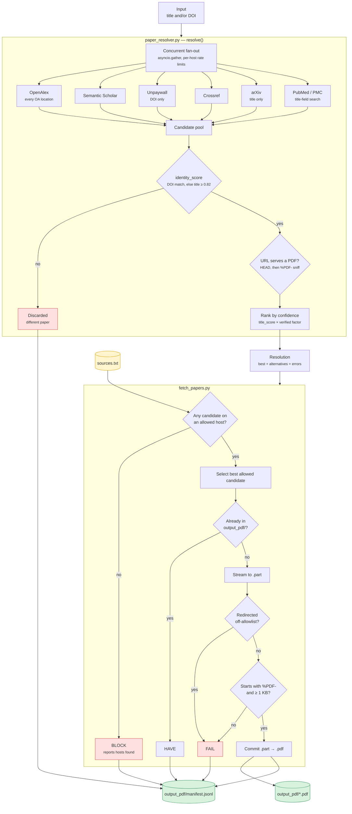

# Paper PDF Resolver

Resolves a cited paper — by title, DOI, or both — to a verified open-access PDF, and downloads it only from sites you have explicitly allowed.

Built as the **evidence-acquisition node** for a citation-verification pipeline: given a citation, find the actual paper. A wrong PDF returned confidently is worse than no PDF, so every hit is title-verified, host-checked, and byte-validated before it lands on disk.

**Validated 2026-08-08** — see [`VALIDATION.md`](VALIDATION.md) for every case that was checked, what it returned, and what is still not covered. Both of these end-to-end paths are verified against the live APIs:

```powershell
py fetch_papers.py "Attention Is All You Need"     # OK — 2.2 MB from arxiv.org
py fetch_papers.py --doi 10.1038/sdata.2016.18     # OK — from nature.com
```

Run `py validate_offline.py` for the 61 offline checks; it needs no network and takes under a second.

Before trusting output, read [Known limitations](#known-limitations-and-open-problems). The manifest `doi` now names the copy that was actually downloaded, so it is safe to pass downstream — but **a preprint's DOI is not the published DOI**, and the resolver will return a preprint for a paywalled citation.

---

## Install

```powershell
py -m pip install httpx
```

> On macOS/Linux use `python3 -m pip install httpx`, and `python3` in place of `py` in every command below.

Set your contact email in `paper_resolver.py` before the first run:

```python
CONTACT_EMAIL = "you@example.com"
```

Not optional — Unpaywall rejects requests without it, and Crossref and OpenAlex drop unidentified clients into a throttled anonymous pool.

---

## Commands

| Command | What it does |
|---|---|
| `py fetch_papers.py "Attention Is All You Need"` | Resolve one title, download to `output_pdf/` |
| `py fetch_papers.py "Deep learning" --doi 10.1038/nature14539` | Title + DOI — DOI resolves, title verifies the match |
| `py fetch_papers.py --doi 10.1038/nature14539` | DOI only |
| `py fetch_papers.py "Title A" "Title B" "Title C"` | Several titles in one run |
| `py fetch_papers.py --from-file titles.txt` | Batch from a file, one paper per line |
| `py fetch_papers.py "..." --sources my_sources.txt` | Use a different allowlist |
| `py fetch_papers.py "..." --out pdfs` | Write somewhere other than `output_pdf/` |
| `py fetch_papers.py "..." --workers 8` | More papers in flight (default 4) |
| `py fetch_papers.py "..." --any-host` | Ignore the allowlist entirely |
| `py paper_resolver.py` | Resolve-only smoke test, no downloads |
| `py validate_offline.py` | 61 offline checks — allowlist, matching, ranking, filenames, run cost |

### Batch file format (`--from-file`)

One paper per line. Blank lines and `#` comments ignored.

```
Attention Is All You Need
doi:10.1371/journal.pmed.0020124
Deep learning | 10.1038/nature14539
```

The third form is the most reliable: the **DOI** pins exact identity, the **title** confirms the returned record is really that paper.

---

## Files

| File | Role |
|---|---|
| **`sources.txt`** | **The file you edit.** Sites you allow PDFs to come from, one URL per line. |
| **`paper_resolver.py`** | The resolver library. Queries six scholarly APIs, scores title matches, verifies PDF URLs. Also exposes the agent tool schema. |
| **`fetch_papers.py`** | CLI runner. Applies the allowlist, downloads, writes the manifest. |
| `validate_offline.py` | Offline check harness. Run it after touching matching, ranking or naming. |
| `runcost.py` | What a run cost — wall time, CPU time, peak RAM. Dependency-free; a verbatim copy lives in `source-semantic-tool/`. |
| `VALIDATION.md` | What has been validated, in which cases, and what has not. |
| `output_pdf/` | Created on first run. Downloaded PDFs. |
| `output_pdf/manifest.jsonl` | Appended every run — one JSON record per paper with status, path, matched title, confidence, source, per-API errors, and what the run cost. |

### `sources.txt`

```
https://arxiv.org/
https://pubmed.ncbi.nlm.nih.gov/
nature.com
```

Full URLs, bare domains, and `www.` prefixes all normalize to the same host. Listing a domain covers its subdomains, so `arxiv.org` also allows `export.arxiv.org`, and `ncbi.nlm.nih.gov` covers the `ftp.` host PMC actually serves from.

Matching is **suffix-anchored**: `arxiv.org.evil.com` does not pass.

---

## Data flow



### One work, several candidates

A source can contribute more than one candidate, and usually should. OpenAlex, in particular, is asked for *every* open-access location it knows about rather than just its own `best_oa_location` — for "Attention Is All You Need" it ranks a predatory mirror (`langtaosha.org.cn`) above the canonical `arxiv.org/pdf/1706.03762`, and both arrive in the same response. Semantic Scholar likewise falls back to `arxiv.org/pdf/<id>` from `externalIds.ArXiv` when it reports no `openAccessPdf`.

That is why `alternatives` in the manifest often lists the same `source` twice. It is deliberate: more candidates means more chances one of them sits on a host you trust, and each still has to clear every guard below.

### Where each guard sits

| Guard | Stage | Catches |
|---|---|---|
| `identity_score()` | Resolver | Ranks a hit's proof of identity: matching DOI → 1.0; a hit from a *title search* against a DOI-pinned query → 0.0; otherwise title similarity |
| Title similarity ≥ 0.82 | Resolver | An index returning a *different paper* for your query |
| `pick_best()` | Resolver | Identity outranks fetchability, so a reachable near-match can never displace an exact match whose PDF happens to be paywalled |
| PMC record identity | Resolver | PMC search is *full-text*, so its hits are scored on the record's own title/DOI, never on the query |
| `HEAD` / `%PDF-` sniff | Resolver | A `.pdf` URL that actually serves an HTML paywall |
| Allowlist filter | Runner | Mirrors, aggregators, and pirate sites |
| Post-redirect re-check | Runner | A trusted link that bounces somewhere untrusted |
| Magic bytes + size | Runner | Login pages and truncated transfers reaching disk |

### Network resilience

`_get()` retries up to `max_retries` (default 3) with exponential backoff on **both** `429`/`5xx` status codes *and* transport-level failures — `httpx.TransportError` covers read timeouts, connection drops, and `RemoteProtocolError`. Scholarly APIs frequently throttle by stalling the connection rather than answering `429`, and without this a single hiccup silently deletes a whole source from the fan-out.

A source that still fails lands in `errors` in the manifest and the run continues on the other five. **A run with errors is not a failed run** — the verified `"Attention Is All You Need"` download above succeeds while both arXiv and Semantic Scholar are returning `429`.

---

## Statuses

| Status | Meaning | What to do |
|---|---|---|
| `OK` | Downloaded and validated | — |
| `HAVE` | Already in the output directory | — |
| `MISS` | No open-access PDF found anywhere | Nothing automatic — escalation is [not built yet](#4-miss-has-no-escalation-path--not-built) |
| `BLOCK` | Found, but not on an allowed host | Add the host to `sources.txt`, or leave blocked |
| `FAIL` | Resolved but the download failed validation | Usually a paywall; check the detail line |

Read `manifest.jsonl` rather than listing the directory — it carries the provenance downstream verification needs.

---

## Run cost

Every run ends with what it cost, and every manifest record written by that run carries the same figures under `usage`:

```
run cost: 12s wall  0.33s CPU (3% of one core)  peak RAM 53 MB  (now 53 MB)
```

| Field | Meaning |
|---|---|
| `wall_seconds` | Measured from the program's first line, so imports and argument parsing are inside it |
| `cpu_seconds` | This process, across all its threads. Twelve seconds of wall for a third of a second of CPU is the normal shape here: the run is waiting on six APIs, not computing |
| `cpu_percent` | `cpu_seconds` over `wall_seconds`, as a share of **one** core. Above 100% means several cores were busy at once |
| `peak_rss_bytes` | The OS's own process-lifetime high-water mark, not a sample — a peak between two readings cannot be missed |
| `rss_bytes` | Resident at the moment the line was printed |

The figures are whole-run, not per-paper: papers resolve concurrently, so there is nothing to divide. What they cannot see is other processes — the scholarly APIs do their work on their own machines, so a cheap-looking run is cheap *here*. On a platform whose memory counters cannot be read the two RAM fields are `null` and print as `n/a`, rather than a zero that would read as a measurement.

---

## Using it as an agent tool

`paper_resolver.py` exports both halves of the tool surface:

```python
from paper_resolver import FIND_PAPER_PDF_TOOL, find_paper_pdf

# FIND_PAPER_PDF_TOOL -> pass in your tool list (Anthropic function-calling schema)
# find_paper_pdf(title=..., doi=...) -> await on the matching tool_use event
```

Returns a dict with `pdf_url`, `doi`, `work_doi`, `matched_title`, `confidence`, `source`, `alternatives`, and `errors`. `doi` is the identity of the copy on offer; `work_doi` is the index's work-level DOI and is not proof of anything. A null `pdf_url` means no open-access copy was found — **not** that the paper doesn't exist, and the agent prompt should say so explicitly, or it will report fabrication where there is only a paywall.

For batch verification, hold one `PaperResolver` open and call `.resolve()` directly instead of `find_paper_pdf()`, which opens a client per call:

```python
async with PaperResolver() as resolver:
    for citation in citations:
        result = await resolver.resolve(title=citation.title, doi=citation.doi)
```

---

## Known limitations and open problems

Ordered by how much damage they can do downstream.

### 1. A paywalled citation resolves to its preprint, under the preprint's DOI — *by design, but know it*

The manifest `doi` now names the copy that was downloaded, not the work record it was merged into. For an arXiv copy that means the arXiv DOI:

```
"doi":      "10.48550/arXiv.1706.03762",   <- what you actually have
"work_doi": "10.65215/2q58a426"            <- what the index called the work
```

Both are reported, and the filename uses the first. This is correct, but it means **a resolved `doi` will often not equal the DOI you asked for** — a citation to a published paper commonly resolves to the preprint that is actually open access. A downstream verifier must treat preprint-vs-published as a match, not a discrepancy, and should compare `work_doi` when it needs the published identity.

`work_doi` carries no such guarantee: it is whatever the index merged into the record, junk mirrors included. Do not feed it to a verifier as proof of identity.

### 2. arXiv and Semantic Scholar throttle hard — *mitigated, not solved*

- **arXiv's API** returns `429 Rate exceeded.` with **no `Retry-After` header**, and the block persists well past the retry budget. Only the API is throttled — `arxiv.org/pdf/...` itself stays fetchable, which is why ["One work, several candidates"](#one-work-several-candidates) matters: the arXiv PDF is reachable through OpenAlex and Semantic Scholar without touching the arXiv API at all.
- **Semantic Scholar** 429s regularly for unauthenticated clients. There is no API-key support in the code; adding one would raise the ceiling.

Consequence: recall drops when these two are blocked, and a paper only they know about becomes a `MISS`.

### 3. PMC records that publish no PDF are unreachable — *unfixed*

Some open-access PMC records offer only a `.tar.gz` package, no `pdf` link. `10.1038/sdata.2016.18` (`PMC4792175`, CC BY) is one: `_pmc_oa_pdf()` correctly returns `None` and PubMed contributes nothing. That paper is only obtainable here because `nature.com` also serves it. Fixing this means downloading and unpacking the OA tarball.

### 4. `MISS` has no escalation path — *not built*

The intended escalation — hand a `MISS` to a crawler such as Firecrawl `/search` — is a plan, not code. A `MISS` currently ends the line; the manifest records it and nothing else happens.

### 5. Offline checks only — *partly built*

`py validate_offline.py` asserts 61 cases across the allowlist, batch grammar, title matching, identity scoring, ranking, filename construction and run-cost accounting, and exits non-zero on failure. It is not a `pytest` suite and it has no fixtures.

What it cannot cover is the network half: every API response shape, throttling behaviour and PDF-verification result is exercised only by running the tool for real. The live cases that were checked, and their results, are listed in [`VALIDATION.md`](VALIDATION.md). `py paper_resolver.py` remains a smoke test that asserts nothing — you read its JSON yourself.

### 6. `--any-host` can prefer a mirror over the canonical copy — *minor*

With the allowlist off, a mirror and the real publisher tie at `confidence: 1.0` and insertion order decides. The default allowlist path is unaffected. If you use `--any-host`, read `alternatives` before trusting `best`.

### 7. Every run re-queries all six APIs — *minor*

No caching between runs. `HAVE` short-circuits the *download* once a file is on disk, but resolution still costs six API calls per paper. Fine for batches of tens, wasteful for thousands.

### Also worth knowing

- **Two recall trade-offs were taken deliberately**, both in favour of returning nothing over returning the wrong paper. A DOI-pinned query now rejects title-search hits outright, so a paper that only arXiv or PMC's full-text index knows about becomes a `MISS` rather than an unverified guess. And the containment bonus is one-directional, so citing a short form of a long title no longer matches the full record. If you are chasing recall rather than provenance, these are the two knobs to reconsider first.
- **A one-word-different title can still enter the candidate pool.** "Not All Attention Is All You Need" scores 0.86 against "Attention Is All You Need" on raw sequence ratio; it is held under the threshold by an explicit prepend rule, but the general problem — titles that differ by a negation — is not solved by string similarity and would need author or year metadata to close.
- Paywalled publishers in the starter `sources.txt` (ScienceDirect, Wiley, IEEE, ACM) pass the host check and then fail PDF validation on the login page — see the note under [Tuning](#tuning).
- `CONTACT_EMAIL` must be a real address. Unpaywall rejects requests without one; Crossref and OpenAlex demote unidentified clients into a throttled anonymous pool, which makes everything above worse.

---

## Fixed recently

Kept here because each was a silent-wrong-answer bug, and the reasoning is worth not re-deriving.

| Fix | Was | Now |
|---|---|---|
| **DOI-pinned queries** | A hit from a *title search* could satisfy a query that supplied a DOI. `Deep learning \| 10.1038/nature14539` downloaded arXiv 1807.07987 — a different paper by different authors — at confidence 1.0, because `identity_score()` only compared DOIs when the *candidate* had one and otherwise fell through to the title. | Candidates carry `doi_keyed`: true only for records fetched *by DOI lookup*. A title-search hit scores 0.0 against a DOI-pinned query. The same case now reports `FAIL` — the paper is paywalled — instead of the wrong PDF. |
| **Identity vs fetchability** | Ranking on `confidence` let the 0.7 unverified discount overrule identity, so a title-only match with a reachable PDF (1.0) beat an exact DOI match whose PDF was paywalled (0.7). | `pick_best()` ranks identity first and uses verification only to break ties *within* the top identity tier. |
| **Containment scoring** | `title_similarity()` returned 0.95 whenever either title contained the other, so a candidate that *added* words scored as a match: "Not All Attention Is All You Need" and "Tensor Product Attention Is All You Need" both entered the pool at 0.95 for the query "Attention Is All You Need". | The bonus applies only when the *found* title is the shorter one — the truncation the rule exists for. Prepended words are held under the threshold. |
| **Borrowed identity in filenames** | `slugify()` fell back to the *requested* DOI when the matched candidate had none, stamping an identity onto content that never matched it: a file containing arXiv 1807.07987 was named `deep-learning_10-1038-nature14539.pdf`. | Only the matched copy's own DOI names the file; with nothing proved, a URL digest disambiguates instead. |
| **Location identity** | Candidates inherited the **work-level** DOI, so a correct arXiv PDF was filed under a predatory mirror's junk DOI (`10.65215/2q58a426`) in both the manifest and the filename. | `location_doi()` derives the copy's own DOI where the host mints one. The manifest reports `doi` (the copy) and `work_doi` (the record) separately. |
| **DOI slug truncation** | The filename kept the *last* 24 characters of the DOI slug, cutting the registrant prefix off the front (`..._-1038-s41598-025-25616-x.pdf`). | Keeps the head, so the DOI stays readable and parseable. |
| **PubMed identity** | `_pubmed()` built its candidate from the **query**, so `title_similarity(query, candidate.title)` compared the query to itself and always scored `1.0`. The title guard was structurally incapable of rejecting a PMC hit — the tool downloaded a Nigerian Medical Journal article labelled "Attention Is All You Need". | Title and DOI come from an `esummary` lookup of the record itself. Hits must prove identity from their own metadata. |
| **PMC search scope** | An unqualified `db=pmc` term is a *full-text* search: "Attention Is All You Need" matched 738,377 articles, and results came back newest-first. | Titles are pinned to the title field as a quoted phrase (`"…"[title]`) with `sort=relevance`. DOIs are still searched bare, then identity-filtered. |
| **DOI-mismatch scoring** | A DOI-only query whose candidate carried a *different* DOI scored `0.9` and passed the `0.82` threshold. | `identity_score()` returns `0.0`. A differing DOI with a title present still defers to the title, so preprint-vs-published DOIs are not rejected. |
| **Discarded OA locations** | `_openalex()` read only `best_oa_location`, discarding the arXiv PDF sitting in the same response. | Every location with a `pdf_url` becomes a candidate. |
| **Retry gap** | `_get()` retried status codes only, so a `ReadTimeout` deleted a source from the fan-out on the first hiccup. | Transport errors retry with backoff too. |
| **Manifest ranking** | `process()` reassigned `resolution.best` without reordering `candidates`, so `alternatives` re-listed `best` and hid the top-ranked blocked candidate. | Candidates are re-ranked; blocked hits stay in the manifest at their true position. |

⚠️ Do **not** add `ArXiv` to Semantic Scholar's `fields` parameter. It accepts top-level names only and returns `400 Unrecognized or unsupported fields: [ArXiv]`, which kills the whole source. The arXiv ID already arrives inside `externalIds`.

---

## Tuning

| Setting | Where | Note |
|---|---|---|
| `TITLE_MATCH_THRESHOLD` | `paper_resolver.py` | 0.82. Raise for stricter matching, lower if legitimate papers are being dropped. |
| `verify_pdfs=False` | `PaperResolver(...)` | Skips the HEAD/sniff round trip. Faster, less safe. |
| `max_retries` | `PaperResolver(...)` | 3. Attempts per request, backing off `2 ** attempt` seconds, for both throttling and transport errors. |
| `RateLimiter` intervals | `paper_resolver.py` | NCBI 3 req/s and arXiv 1 per 3s are *their* published limits — raising these gets your IP throttled. |
| `MIN_PDF_BYTES` | `fetch_papers.py` | 1 KB floor for a real paper. |

Several publishers in the starter `sources.txt` — ScienceDirect, Wiley, IEEE, ACM — are paywalled for most articles. They pass the host check, then fail PDF validation on the login page and report as `FAIL`. Trim them if you only want open access.
